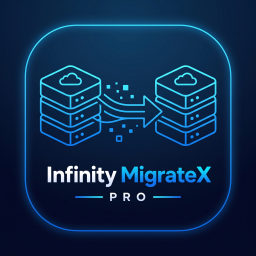

# ∞ Infinity MigrateX Pro — WordPress Migration, Backup & Deployment Suite

**Migrate, back up and restore a complete WordPress site — without timeouts and without breaking serialized data.**

**By [Derouiche Oussama](https://www.derouicheoussama.com) — ∞ Infinity Coder**

[⬇ Download the latest release](https://github.com/derouicheoussama/infinity-migrate-pro/releases/latest) · [Site web](https://www.derouicheoussama.com) · [WordPress.org profile](https://profiles.wordpress.org/derouicheoussama/)

---

## What is Infinity MigrateX Pro?

Infinity MigrateX Pro is a free, open-source **WordPress migration and backup plugin**. It changes a site's domain with serialized-safe URL replacement, clones a site to a staging folder with its own database, schedules automatic backups with retention, restores checksum-verified backups, and scans the installation for security issues.

Unlike classic backup plugins, **every long operation runs in small resumable chunks**: a migration or backup survives PHP time limits, network cuts and server restarts — it pauses itself and resumes exactly where it stopped, with progress bars that reflect real work (files copied, rows processed, bytes written).

## Why you will like it

| | |
|---|---|
| 🚀 **No timeouts** | Chunked engine — works on shared hosting with tiny `max_execution_time` |
| ⏸️ **Pause & resume** | Every operation (migration, backup, restore, scan) resumes where it stopped |
| 🔗 **Serialized-safe URLs** | PHP serialized data and JSON are decoded, replaced, re-encoded — Elementor and WooCommerce stay intact |
| 📊 **Real progress** | Bars reflect files, rows and bytes actually processed. No fake stats, ever |
| 🛡️ **Security first** | Nonce + capabilities on every action, .htaccess-protected storage, Zip-Slip-proof package imports, core checksums from WordPress.org |
| 🔍 **Verified integrity** | SHA-256 manifests on every backup and package; restore refuses corrupted archives before writing |
| 🧾 **Full activity log** | Status, duration, files, rows, size — filterable, searchable, CSV/JSON export |
| 🚫 **Zero telemetry** | No hidden tracking, no obfuscated code, no phoning home |

## Feature tour

- **Migration assistant (6 steps)** — source → destination → components → exclusions → real preflight checks → execution
  - Domain change with full URL rewrite (dry-run preview included)
  - Site cloning to another folder + fresh database + generated `wp-config.php`
  - `.infinitymigrate` package export: one file for the new host
  - Partial migrations: core, plugins, themes, uploads, mu-plugins, wp-content, database
- **Backups** — full / files-only / database-only, scheduled daily/weekly/monthly with automatic retention
- **Guided restore** — integrity verified *before* writing, component selection, optional pre-restore safety backup
- **Verified package import** — zip signature, manifest, checksums, content scan, explicit confirmation
- **Smart URL replacer** — serialized-safe, JSON-aware, with dry-run
- **Database manager** — tables, export, verified SQL import, optimize/repair with confirmation
- **Security scanner** — WordPress.org core checksums, PHP-in-uploads, suspicious patterns, large files, permissions

## Installation

1. In WordPress admin: **Plugins → Add New → Upload Plugin**, pick `infinity-migrate-pro.zip`.
2. Activate, then open the **Infinity MigrateX Pro** menu.
3. Tip: run a full backup before your first migration.

Or copy the `infinity-migrate-pro` folder into `/wp-content/plugins/` via FTP.

## Requirements

- WordPress 5.8+ · PHP 7.4+ · ZipArchive extension
- Works on shared hosting — no shell access, no special server config

## FAQ

**Will URL replacement break my serialized data?**
No — that is its core design: serialized values are decoded, replaced recursively, re-serialized with correct lengths. Unreadable serialized data is never touched. JSON goes through the same decode → replace → encode path.

**Can my host's PHP timeout interrupt a backup?**
No. The engine works in time-boxed chunks; each request advances a few seconds and saves its state. Operations pause themselves and resume with one click.

**Are my backups deleted on uninstall?**
Never. Even the opt-in "delete plugin data" setting only removes settings, logs and reports — archives stay on disk.

## Author

**Derouiche Oussama** — [derouicheoussama.com](https://www.derouicheoussama.com) · [GitHub](https://github.com/derouicheoussama) · [WordPress.org](https://profiles.wordpress.org/derouicheoussama/) · Instagram / Facebook / TikTok: `@derouiche.oussama`

License: [GPL v2 or later](LICENSE) · ∞ Infinity Coder
